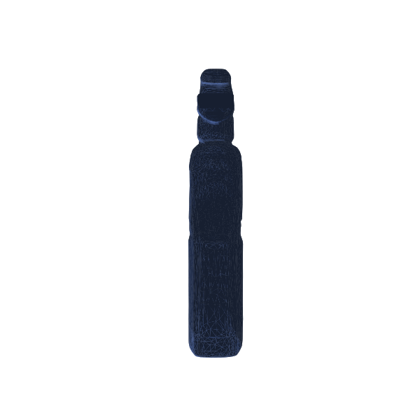

# photo-to-mesh

[](https://github.com/Hasasasaki/photo-to-mesh/actions/workflows/ci.yml)
[](LICENSE)


Turn photos of a real object into a **clean, scaled, downloadable 3D mesh** —
locally, in an interactive **web GUI**. Photograph a thing → download a
millimetre-correct `.stl` for your slicer (or a `.glb` for Blender/Unity/web).

<p align="center">
  
  <br>
  <em>A few phone photos → a 3D mesh (Hunyuan3D multi-view), object isolated with SAM 3.</em>
</p>

What it adds over a stock image-to-3D demo:

- **Real-world scale** — type one known dimension (e.g. height = 255 mm) and
  export a GLB in mm/cm/m **plus an STL in mm** that drops straight into a slicer.
- **Text-prompted object isolation** — name the object (`"the blue spray bottle"`,
  SAM 3) or use `rembg`; no click-masking, no manual cropping.
- **Single image _and_ multi-view** — Hunyuan3D-2.1 from one photo, or
  Hunyuan3D-2mv fusing 1–4 canonical views.
- **Local and private** — open weights running on your GPU; no API keys, nothing uploaded.
- **Experimental photogrammetric routes** — VGGT → mesh / 2D Gaussian Splatting
  for true multi-view reconstruction (see [Experimental routes](#experimental-routes-photogrammetric-reconstruction)).

## Quickstart

```bash
git clone https://github.com/Hasasasaki/photo-to-mesh && cd photo-to-mesh
./setup.sh core      # uv venv + PyTorch (CUDA) + deps — no sudo needed
./setup.sh routeC    # Hunyuan3D-2.1, the core engine
./run_gui.sh         # → open http://localhost:7860
```

Upload a photo, click **Generate mesh**, orbit the result, download. The first
generate downloads the shape weights (~8 GB; multi-view adds ~5 GB on its first
use) — or pre-fetch with `./setup.sh download hunyuan-shape`.

> **SAM 3 masking is optional.** Its weights are gated on Hugging Face
> (`huggingface-cli login`, then request access on the model page). Until then,
> pick **`rembg auto`** as background removal — it needs no account.

## Requirements

| | |
|---|---|
| **GPU** | NVIDIA with CUDA. Validated on an **RTX 5090 (32 GB)**; other cards should work — CUDA builds auto-detect your arch via `nvidia-smi` (override with `TORCH_CUDA_ARCH_LIST`). **[Report what works on your card](../../issues/new?template=gpu_report.yml)** — it's the most useful contribution right now. |
| **VRAM** | Not yet profiled across cards. The fp16 shape checkpoint alone is 7.4 GB, so ~12 GB is a realistic floor for shape-only; the texture stage wants more. |
| **System RAM** | Works on a 30 GB box — large checkpoints are mmap-loaded to avoid doubling in CPU RAM. CPU-only inference is not practical. |
| **Disk** | ~8 GB (shape) / ~15 GB (shape + texture), +~5 GB for multi-view, +~5 GB for VGGT. Cached in `~/.cache`; everything is offline after the first run. |
| **OS / Python** | Linux (tested). Python 3.10–3.12, managed by `uv`. No sudo required anywhere. |
| **CUDA wheels** | `cu128` index by default (required for Blackwell/RTX 50xx, fine on Ampere+). Override: `CUDA_INDEX=https://download.pytorch.org/whl/cu124 ./setup.sh core`. |

## The GUI

```bash
./run_gui.sh
# then open http://localhost:7860 in a browser
```

Two tabs, both with the same controls:

- **Single image (2.1)** — upload one photo → mesh.
- **Multi-view (2mv)** — fill **1–4 slots** (Front / Left / Back / Right) → fused mesh.
  Canonical order matters: front, left = 90° CW, back, right = 270°.

| Control | What it does |
|---|---|
| Background removal | `SAM 3 prompt` (name the object, e.g. `"the blue spray bottle"`), `rembg auto`, or `none` |
| Diffusion steps | quality vs speed (default 50) |
| Octree resolution | mesh detail (128–512, default 384) |
| Guidance scale | faithfulness to the image (default 7.5) |
| Seed | change for different plausible back-sides |
| Keep largest component | drops stray floaters |
| **Known real size** + unit + axis | impose metric scale, typed in the unit you measured in (see [Scale & resize](#scale--resize)) |
| **OBJ numbers unit** (`mm`/`cm`/`in`) | unit the OBJ's raw numbers are written in — the GLB is **always metres** (glTF standard) and the STL **always mm** (slicer standard) |
| **↺ Resize & re-export** | re-scale the *last* mesh instantly — **no GPU re-run** |

**Outputs** (in `data/output/`): an interactive orbit viewer plus downloads —
`gui_<mode>.glb` (metres), `gui_<mode>.stl` (mm), `gui_<mode>_<unit>.obj`.

## Scale & resize

Images carry **no absolute size**, so scale is *imposed*, not measured:

1. Measure one real dimension of the object (e.g. bottle height ≈ 25 cm).
2. Enter it as **Known real size**, pick the unit you measured in (`mm`/`cm`/`in`),
   and the axis (`tallest` is robust).
3. The readout echoes the result in **mm, cm and m** — if that doesn't match
   your ruler, the entry was wrong; fix it and hit **↺ Resize** (no GPU re-run).

Each download is written in the unit its consumers actually assume. In
particular, glTF has **no unit field** — the spec hard-defines 1 unit = 1 metre —
so "a GLB in cm" is not something Blender/Unity/three.js can ever read at the
right size (it imports 100× too big). That's why the GLB unit is not a choice:

| File | Numbers are in | Open it in |
|---|---|---|
| `.glb` | **metres** — fixed, the glTF standard | Blender / Unity / three.js / web viewers |
| `.stl` | **mm** — fixed, what slicers assume | any 3D-print slicer |
| `.obj` | **your choice** (default mm) | tools where you type/expect raw numbers |

> Until a real size is set, the mesh stays in Hunyuan's normalized units
> (longest axis ≈ 2.0). The GLB is still produced for viewing, but STL/OBJ are
> held back so a "2 mm bottle" never reaches a slicer by accident.

> **Note on the bounding box readout:** the three numbers are `mesh.extents`
> (`max−min` per axis) in normalized units; one is always ≈2.0 because Hunyuan fits
> the longest axis to the `[-1,1]` cube. The `W×H×D` labels assume the object is
> upright (height along Y) and can be mislabeled if it was photographed lying down —
> the *scaling itself* (via `tallest`) is unaffected.

## CLI (no GUI)

```bash
source .venv/bin/activate
# single image
python routeC_feedforward/run_hunyuan.py \
    --image "data/images/your.jpg" --mask "data/masks/your.png" \
    --out data/output/mesh.glb --no-texture
# turntable preview of any mesh
python src/turntable.py data/output/mesh.glb --out data/output/mesh_turntable
```

> CLI exports are in Hunyuan's normalized units (no scaling step yet) — use the
> GUI for scaled, slicer-ready output.

## How it works — Hunyuan3D

**Hunyuan3D is a *generative* 3D model, not a photogrammetric one.** It was trained
on `(image → 3D asset)` pairs and learns a prior `P(shape | image)`. Given a photo,
a flow-matching **DiT** denoises a 3D latent conditioned on image tokens; a VAE
decodes it to an occupancy/SDF field, and marching cubes extracts the surface. The
unseen sides of the object are **plausibly invented** from the learned prior.

```
                         ┌─────────────────────────────────────────────┐
  photo(s) ──► SAM 3 ──► │  CORE: Hunyuan3D  (generative image → mesh)  │ ──► .glb / .stl
              (mask)     │   • Single image   (Hunyuan3D-2.1)           │
                         │   • Multi-view 1-4 (Hunyuan3D-2mv)           │
                         └─────────────────────────────────────────────┘
  many photos ─► SAM 3 ─► VGGT poses+pointmap ─► Open3D mesh  (Route A)  ──► .obj   (reconstruction)
                                              └─► 2D Gaussian Splatting  (Route B)  ──► .ply
```

Two variants are wired up:

| Mode | Checkpoint | Conditioner | Input |
|------|------------|-------------|-------|
| **Single image** | `tencent/Hunyuan3D-2.1` (`hunyuan3d-dit-v2-1`) | `SingleImageEncoder` | 1 image |
| **Multi-view** | `tencent/Hunyuan3D-2mv` (`hunyuan3d-dit-v2-mv`) | `DinoImageEncoderMV` (4 view embeddings) | 1–4 named views: front / left / back / right |

Multi-view still *generates*, but conditions on several views via per-view
embeddings (it does **not** triangulate — it has no camera poses). For true
geometry from many photos, use the VGGT routes below.

**Consequences worth knowing:**
- Output is in **normalized units** (object fit into a ~`[-1,1]` cube). There is no
  metric scale from images alone — you impose it (see [Scale & resize](#scale--resize)).
- Multi-view expects **canonical orthogonal views** (front, left = 90° CW, back,
  right = 270°). Feeding similar/oblique views degrades the result.
- Transparent/reflective parts (e.g. liquid) aren't physically reconstructed.

## Experimental routes (photogrammetric reconstruction)

> ⚠️ Implemented but **not yet validated end-to-end** — treat these as working
> starting points, and please report results. The same applies to the Hunyuan
> PBR **texture stage** (needs the `custom_rasterizer` CUDA build).

For genuine multi-view geometry from many photos (not generation):

```bash
source .venv/bin/activate
# Route A — VGGT point map -> Open3D mesh (fast, no extra build)
python src/mask_sam3.py --images data/images --out data/masks --prompt "the mug"
python src/pose_vggt.py  --images data/images --masks data/masks --scene data/output/scene
python routeA_photogrammetry/mesh_from_pointmap.py --scene data/output/scene --out data/output/mesh_A.obj

# Route B — VGGT poses -> 2D Gaussian Splatting -> TSDF mesh (needs ./setup.sh routeB)
routeB_2dgs/run_2dgs.sh data/output/scene data/output/2dgs
```

**VGGT** (feed-forward) replaces COLMAP for camera poses — no sudo, robust on few
photos. `run_pipeline.sh` drives the whole thing (video → frames → masks → routes).

## Project layout

```
photo-to-mesh/
├── app.py                     # the GUI (single + multi-view tabs, scale, resize)
├── run_gui.sh                 # launch the GUI
├── run_pipeline.sh            # CLI driver for the photogrammetric routes
├── setup.sh                   # uv env + deps (pinned) + model downloads
├── pyproject.toml             # uv-managed deps + ruff config
├── src/
│   ├── mask_sam3.py           # SAM 3 object masking (text/concept prompt)
│   ├── pose_vggt.py           # VGGT poses + point map -> COLMAP-format scene
│   ├── turntable.py           # headless GIF/MP4 turntable for any mesh
│   ├── frames_from_video.py   # video -> sharp frames
│   ├── mesh_units.py          # unit conversions for export (tested in CI)
│   └── common.py
├── routeC_feedforward/
│   ├── run_hunyuan.py         # CLI single-image Hunyuan
│   ├── hy3dgen_compat.py      # shim: aliases hy3dgen.shapegen -> hy3dshape (for 2mv ckpt)
│   └── Hunyuan3D-2.1/         # cloned by `setup.sh routeC` (pinned revision)
├── routeA_photogrammetry/mesh_from_pointmap.py
├── routeB_2dgs/{run_2dgs.sh, apply_masks.py}
├── space/                     # Hugging Face Space demo (see space/DEPLOY.md)
├── tests/                     # unit tests (run in CI)
└── data/{images, masks, output}/
```

## Troubleshooting & gotchas

Recorded while bringing the stack up on an **RTX 5090 (Blackwell, sm_120), 30 GB
RAM, no passwordless sudo** — the fixes are baked into the code/scripts:

- **CUDA wheels & arch**: torch installs from the `cu128` index (override with
  `CUDA_INDEX`); CUDA extension builds read your GPU arch from `nvidia-smi`
  (override with `TORCH_CUDA_ARCH_LIST`, e.g. `8.6` for Ampere).
- **Limited RAM**: the 7.4 GB fp16 checkpoint OOMs a naive `torch.load`. We patch
  `torch.load` to use `mmap=True` **for file paths only** (SAM 3 loads from a file
  object, where mmap is invalid — hence the path guard).
- **SAM 3** must run inside a `torch.autocast(cuda, bfloat16)` context, and its
  outputs are CUDA tensors (`.cpu()` before numpy).
- **Hunyuan offline loading** uses `~/.cache/hy3dgen`, not the standard HF cache;
  don't set `HF_HUB_OFFLINE=1` (its loader needs to resolve the snapshot).
- **Hunyuan3D-2mv** config targets the old `hy3dgen.shapegen.*` package; the 2.1
  repo renamed it to `hy3dshape`. `hy3dgen_compat.py` aliases them in `sys.modules`.
- The 2mv DiT borrows its **VAE from `tencent/Hunyuan3D-2`** — that VAE is fetched too.

## Status

| Piece | State |
|---|---|
| SAM 3 masking | ✅ working (gated weights; `rembg` fallback needs no account) |
| Hunyuan single-image (GUI + CLI) | ✅ working, validated on real photos |
| Hunyuan multi-view (2mv) | ✅ working, validated (1–4 views) |
| Scale / resize / unit export / STL | ✅ working |
| Turntable GIF/MP4 | ✅ working |
| Hunyuan PBR **texture** stage | 🧪 experimental — needs `custom_rasterizer` CUDA build; untested |
| Routes A/B (VGGT / 2DGS) | 🧪 experimental — implemented, not yet run end-to-end |
| GPUs other than RTX 5090 | ❓ should work (arch auto-detect) — [reports welcome](../../issues/new?template=gpu_report.yml) |

## Contributing

GPU compatibility reports, bug fixes, and route validation are all welcome —
see [CONTRIBUTING.md](CONTRIBUTING.md). Lint and tests run in CI (`ruff`,
`shellcheck`, `pytest`).

## License

This project's **code** is released under the **MIT License** (see `LICENSE`).

The **models it downloads at runtime keep their own licenses** — review them before
any commercial or redistribution use:
- **Hunyuan3D-2.1 / 2mv** — Tencent Hunyuan Community License (has usage
  restrictions; not a permissive OSS license).
- **SAM 3** — Meta's SAM license (gated download, research-oriented terms).
- **VGGT** — see its repository for terms.

No model weights are vendored in this repo; `setup.sh` fetches them from their
official sources at pinned revisions.

## Acknowledgements

Built on [Hunyuan3D](https://github.com/Tencent-Hunyuan/Hunyuan3D-2.1),
[SAM 3](https://github.com/facebookresearch/sam3),
[VGGT](https://github.com/facebookresearch/vggt),
[2D Gaussian Splatting](https://github.com/hbb1/2d-gaussian-splatting), and
[Gradio](https://www.gradio.app/).
